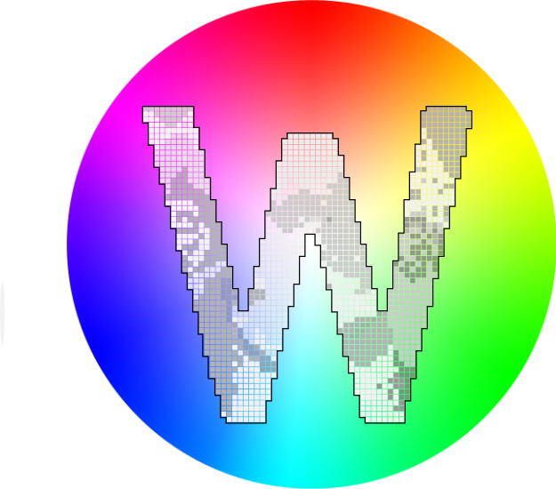

# Whide v2
Whide is an interactive visualization tool to explore a segmentation map, created by the Hierarchical Hyperbolic Self Organizing Map (H2SOM) algorithm.



## Required installations:
To use WHIDE the following installations are required:

1. Docker
2. docker-compose

Docker is not compatible with Windows 7, 8 and 10 Home. For details about a workaround see instructions below.

## Data Creation
To start WHIDE v2 please provide a .HDF5 file that contains the MSI data information.

We refer to our processing pipeline [ProViM](https://github.com/Kawue/provim). For a conversion of already processed data we refer to our [imzML-to-HDF5-Parser](https://github.com/Kawue/imzML-to-HDF5). For a self written processing we refer to [pyImzML-Parser](https://github.com/alexandrovteam/pyimzML/blob/master/pyimzml/ImzMLParser.py)  and  [Pandas](https://pandas.pydata.org/).

All .h5 files need to be saved in the folder `datasets` in the `backend` directory.
Please use only unique and readable file names like: 'barley_101.h5'.

To create the data for WHIDE you can choose between the `h2som` and some new clustering approaches like `k-means` and `agglomerative hierachical clustering`.
In our example below we will use the `h2som` for data creation. How to use the new clustering approaches will be discribed in the handbook.


1. Open a terminal and navigate to the `pyscript` folder.
2. Write these two commands. 
```shell script
docker build -t whide/h2som .

docker run -v <path_to_backend>:/backend  --rm whide/h2som python h2som.py -f <dataset_name>
```
<path_to_backend> is a placeholder for the real path to the backend, for example:
`/home/mmustermann/Documents/whide-v2/backend/`.

<dataset_name> is a placeholder for the dataset file you will use. 

After these two commands all the data for WHIDE is created. 

## Data visualisation in WHIDE
**Remark:** It is possible incorporate a brightfield image or a mask of the dataset into the visualization.
If such an image exists it has to be saved into the `modalities` folder in the backend directory. 

### Step 1: File changing
To visualise the created date in WHIDE you need to change one line in one file. 
1. Navigate in the backend folder and open the `uwsgi.ini` file. 
2. Search the line which starts with `pyargv = ..` (Line 12).
If you got a brightfield image follow step i, if not follow step ii.
    3. Change this line to: `pyargv = -f <dataset_name -i <image_file_name>.`, for example: `pyargv = -f barley_101.h5 -i barley_101_mask.png.`
    4. Change this line to: `pyargv = -f <dataset_name>.`, for example: `pyargv = -f barley_101.h5.`

This step is required for each dataset that should be visualized.

### Step2: Start WHIDE
To start WHIDE, open a terminal and navigate to the frontend directory.

Type:
```shell script
docker-compose up --build -d
```
Don't close the terminal. 
Now start a Browser (Chrome and Firefox are officially supported) and open `http://localhost:8080/`.
If you have several localhosts running the port number 8080 will not be correct.

After each analysis session the docker container should be closed with type:
```shell script
docker-compose down
```


## Handbook
You can find the Handbook for WHIDE [here](Handbook.md)


## Project setup
```
cd whide-v2
npm install
npm run serve
```


## Docker on Windows 7, 8 and 10 Home
1. Visit https://docs.docker.com/toolbox/toolbox_install_windows/. Follow the given instructions and install all required software to install the Docker Toolbox on Windows.
2. Control if virtualization is enabled on your system. Task Manager -> Performance tab -> CPU -> Virtualization. If it is enabled continue with Step X.
3. If virtualization is disabled, it needs to be enabled in your BIOS. Navigate into your systems BIOS and look for Virtualization Technology (VT). Enable VT, save settings and reboot. This option is most likely part of the Advanced or Security tab. This step can deviate based on your Windows and Mainboard Manufacturer.
4. Open your CMD as administrator and call `docker-machine create default --virtualbox-no-vtx-check`. A restart may be required.
5. In your OracleVM VirtualBox selected the appropriate machine (probably the one labeled "default") -> Settings -> Network -> Adapter 1 -> Advanced -> Port Forwarding. Click on "+" to add a new rule and set Host Port to 8080 and Guest Port to 8080. Be sure to leave Host IP and Guest IP empty. Also, add another rule for the Port 5000 in the same way. A restart of your VirtualBox may be needed.
6. Now you should be ready to use the Docker QuickStart Shell to call the Docker commands provided to start this tool.

